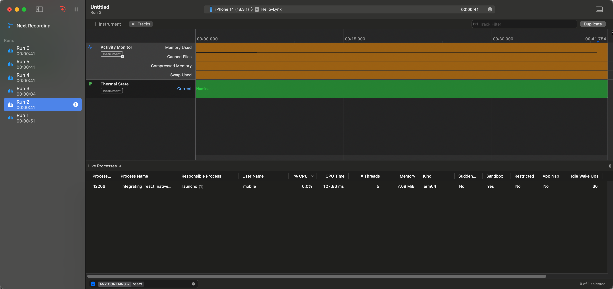
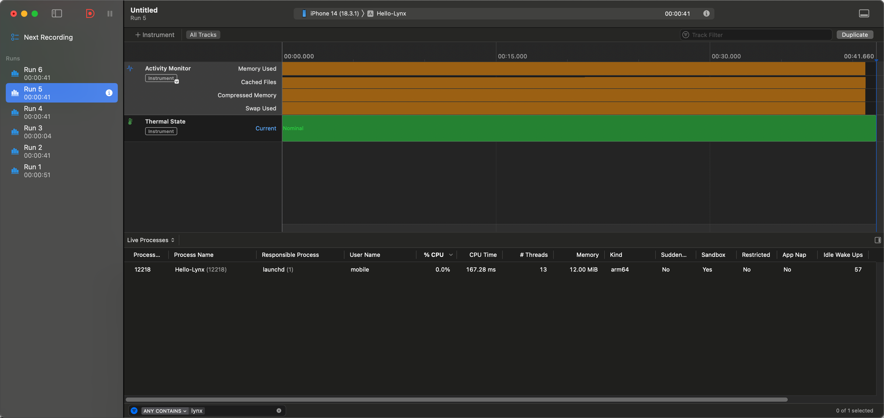
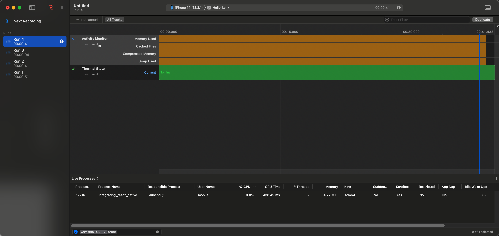
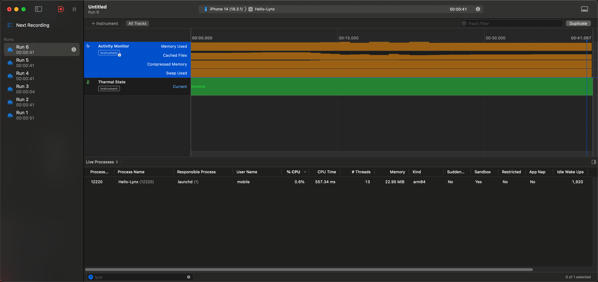
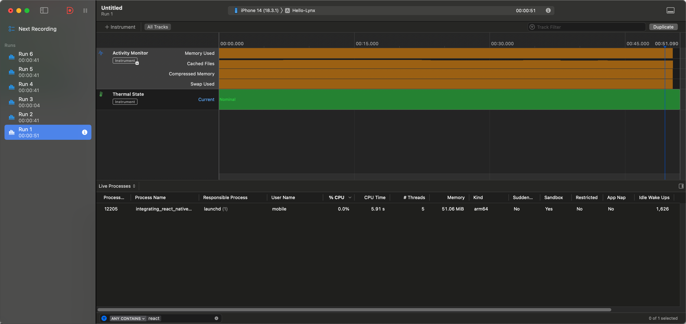
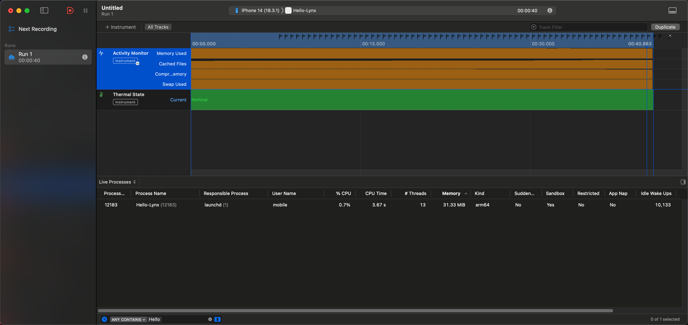

## Test Environment

### Version

#### Lynx 3.1

https://github.com/ArrayZoneYour/integrating-lynx-demo-projects

#### React Native 0.78.0

https://github.com/ArrayZoneYour/integrating_react_native_demo_projects

### Result

#### Android (Pixel 8)

| Scenario            | React Native             | Lynx                     |
| ------------------- | ------------------------ | ------------------------ |
| Empty Component     | 48M ~ 50.3M              | 58.5M ~ 62.6M            |
| List (First Screen) | 133.1M ~ 140M (+ ~90M)   | 101.9M ~ 107.9M (+ ~40M) |
| List (ScrollToEnd)  | 247.7 ~ 250.4M (+ ~110M) | ~155.8M (+ ~50M)         |

#### iOS (iPhone 14)

| Scenario            | React Native            | Lynx                  |
| ------------------- | ----------------------- | --------------------- |
| Empty Component     | ~7 MiB                  | ~12 MiB               |
| List (First Screen) | ~34.3 MiB (+ ~27.3 MiB) | ~23 MiB (+ ~11 MiB)   |
| List (ScrollToEnd)  | ~51 MiB (+ ~16.7 MiB)   | ~31.3 MiB (+ ~8.3MiB) |

### Testcase

#### Empty Component

##### React Native

```tsx
import { AppRegistry } from "react-native";

AppRegistry.registerComponent(appName, () => () => null);
```

##### Lynx

```tsx
import { root } from "@lynx-js/react";

root.render(() => null);
```

##### Result

> I only run these cases once on Pixel 8 and iPhone 14.

> Lynx can reuse item component when component node is the direct children of `<list-item>`

#### Empty Component

**Android**

React Native: 48M ~ 50.3M


Lynx: 58.5M ~ 62.6M


**iOS**

React Native: 7.08 MiB



Lynx: 12.00 MiB



#### First Screen (with 204 item loaded)

Simplify from https://github.com/facebook/react-native/blob/main/packages/rn-tester/js/examples/FlatList/FlatList-multiColumn.js

**Android**


React Native: 133.1M ~ 140M (+ ~90M)


Lynx: 101.9M ~ 107.9M (+ ~40M)


**iOS**

React Native: 34.27 MiB



Lynx: 22.95 MiB



#### Scroll To List Last Item

**Android**


React Native: 247.7 ~ 250.4M (+ ~110M)


Lynx: ~155.8M (+ ~50M)


**iOS**

React Native: 51.06 MiB



Lynx: 31.33 MiB


